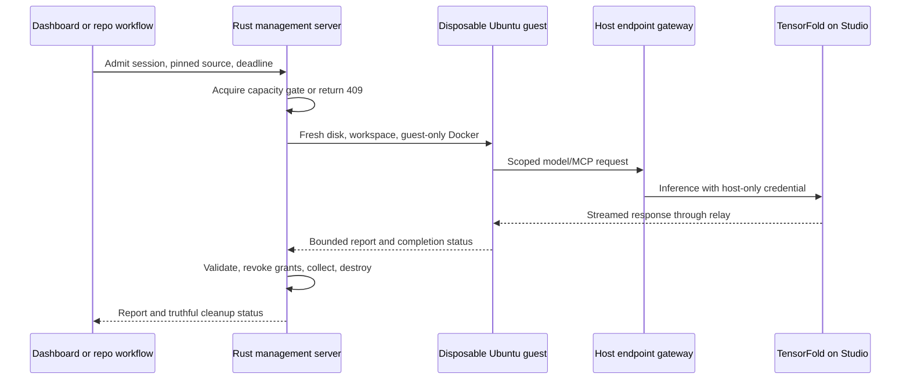

# Disposable OpenCode sessions

The disposable profile adds a fresh KVM guest for each interactive session or
weekly repository audit. Both enter the existing Rust management server through
`/api/v2/disposable-sessions`, share a single capacity gate, and use the same
host-owned expiry and destruction path. The defaults are 16 GiB RAM and six
shared vCPUs. The Ubuntu host runs the VM; TensorFold and model weights remain
on the Mac Studio. No GPU passthrough is required.

The guest can run shell commands, tests, scanners, local MCP processes and its
own Docker daemon. Guest root does not control the host firewall, management
API, endpoint presets or upstream credentials. There are no general host
filesystem shares, host sockets, persistent agent homes or GPU devices in this
profile. The prepared baseline is reused through a new writable disk; each run
gets a new OpenCode home and workspace.

A separate guest data listener relays only operator-selected endpoint presets.
Presets define an exact upstream host/port, URL path and methods, with explicit
permission for a private Studio or MCP address. The gateway rejects redirects,
CONNECT tunneling, unauthorized destinations and DNS address changes. Session
capabilities do not authorize administration. Grant revocation and expiry stop
new requests and close streams. A request already delivered to an upstream
server cannot be retracted.

MCP URL policy controls transport access. It does not make an MCP server's tools
read-only. Use upstream credentials/server capabilities appropriate to the
session; never rely on allowing HTTP POST alone as a restriction on write tools.
Remote Streamable HTTP/SSE traverses the relay; local stdio MCP stays in the VM.

The host keeps admission ownership through collection and cleanup. Failed
cleanup remains visible and prevents another disposable run until containment
is confirmed. Restart reconciliation revokes in-memory access and retries
cleanup of recorded runs. This admission policy covers the new disposable API;
legacy persistent VM/container paths retain their existing behavior and should
not be used to circumvent the single-model capacity policy.

## Weekly repository audits

Each repository has its own small scheduled workflow referencing the reusable
workflow in this fork at a reviewed commit SHA. There is no Git submodule.
Separate weekly nights use the America/Detroit 01:00–06:00 window. The trusted
host adapter submits the repository, exact commit and GitHub run identity;
repository tests and hooks execute only inside the guest. The host enforces the
actual wall-clock cutoff and reserves time for collection and cleanup.

Only the host publisher receives the repository-scoped `GITHUB_TOKEN`. It
validates and redacts the guest report, checks repository/commit provenance,
deduplicates findings, and publishes zero to five new actionable issues. More
findings remain in the report. Sensitive findings in public repositories go to
private review by default. Valid JSON and a scanner warning are not proof of a
real vulnerability: findings require supporting evidence, and incomplete audits
must remain marked incomplete.

GitHub can queue a job before it reaches an idle runner. The controller rejects
busy admissions immediately after the job reaches it. Another idle trusted
runner listener is needed to reject overlapping arrivals promptly. Per-repo
GitHub concurrency groups alone do not protect shared model capacity.

Read [API and host policy configuration](disposable-api.md),
[weekly audit workflows and reporting](weekly-security-audits.md) for caller
examples and [runtime configuration and acceptance](disposable-runtime.md) for
the KVM baseline, privileged runtime boundary and Ubuntu acceptance commands.

## Verification boundary

Portable Rust, Python and dashboard tests use fixture model/MCP/GitHub services.
They verify policy and lifecycle behavior without contacting the Studio, using
real tokens or publishing security findings. Actual Ubuntu KVM isolation,
guest Docker/tool availability, OpenCode interoperability and the selected
OrcaSAQ checkpoint require the documented host acceptance run. Mocked tests do
not establish a VM escape-proof boundary or measured model audit quality.
